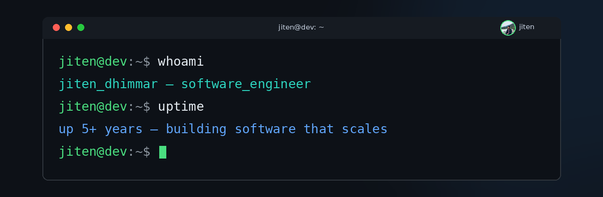
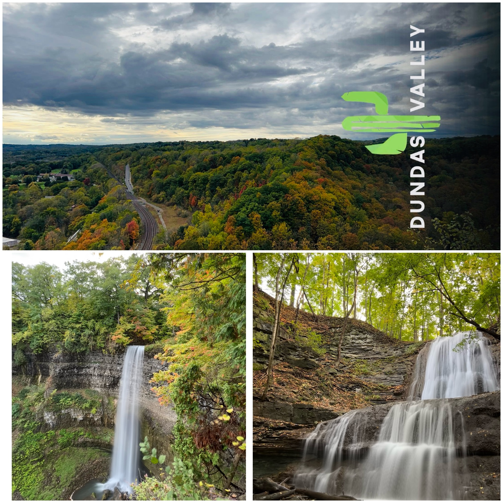

# Hi! I am Jiten Dhimmar

### Nice to meet you. 🤝

📍 Toronto, Ontario, Canada &nbsp;•&nbsp; 🎓 Masters in Applied Computing, University of Windsor

## 👨‍💻 About Me

Software Engineer who turns ideas into applications. I build backend systems with **Spring Boot** and **Python** (Django, FastAPI), work with **Big Data** (Spark, Databricks, Hadoop), and ship on **Azure** cloud. I like building dev tools, automating repetitive work, and experimenting with **GenAI-assisted engineering**.

- 🔭 Currently **SDE2 @ TD Securities** — Risk Platform
- 🤖 Into agent workflows & context engineering
- 💡 I do best in demanding situations when effort, passion, and innovation are required for success

---

## 🧠 Engineering Mindset

Beyond any single stack — what I think about as a software engineer:

- 🤖 How AI-assisted engineering is reshaping the way we build software
- 🏗️ Designing systems that scale gracefully and fail gracefully
- 🛠️ Developer experience: automate the toil, keep the craft

---

## 💼 Experience

_Click a role to expand 👇_

<b>TD / TD Securities</b> — Senior IT Developer · Jan 2023 – Present

 

One of Canada's largest banks; its wholesale banking arm, TD Securities, serves corporate and institutional clients with capital markets services.

Senior-level developer role on the Risk Platform team, held after various other roles across the bank's technology organization.

<b>Elaachi LLC</b> — Voice Assistant Developer · Aug 2021 – Dec 2021

 

A hospitality technology startup building voice assistants that provide 24/7 AI guest support for hotels.

Developer role focused on voice assistant technology.

<b>Green Software</b> — Software Engineer · May 2021 – Jul 2021

 

A software development company based in Surat, India.

Software engineer role in application development.

<b>Institute for Plasma Research</b> — Project Trainee, System Integration · Dec 2020 – Apr 2021

 

An autonomous research institute under India's Department of Atomic Energy, dedicated to plasma physics and fusion energy research.

Trainee role in the system integration group.

---

## 🛠️ My Skills

  

---

## 🚀 Portfolio

- **[django-eCommerce](https://github.com/Jiten1312/django-eCommerce)** — E-commerce web application built with Django & Python
- **[COMP-8547-Web-Search-Engine](https://github.com/Jiten1312/COMP-8547-Web-Search-Engine)** — Web search engine (graduate coursework)
- **[farmer_chatbot_nodApi](https://github.com/Jiten1312/farmer_chatbot_nodApi)** — Node.js API backend for a farmer chatbot

## 📸 Photography

I like clicking photos — especially landmarks. More coming soon.

<!-- PHOTOS:START -->
<table>
  <tr>
    <td align="center" width="33%">
       
      City lights
    </td>
    <td align="center" width="33%">
       
      Somewhere in the mountains
    </td>
    <td align="center" width="33%">
       
      Chasing autumn hues
    </td>
  </tr>
</table>
<!-- PHOTOS:END -->

---

## 📬 Contact Me

📍 Toronto, Ontario, Canada

📧 jitendhimmar1312@gmail.com

